These activities are designed to be worked through actively in a small group. Each one targets a concept and gives you a chance to *do* genetics, not just read about it. Click any card to open the PDF.

```{=html}
<style>
.activity-grid {
  display: grid;
  grid-template-columns: repeat(auto-fill, minmax(220px, 1fr));
  gap: 1.5rem;
  margin: 2rem 0;
}
.activity-card {
  display: flex;
  flex-direction: column;
  border: 1px solid #d8d8d8;
  border-radius: 10px;
  overflow: hidden;
  text-decoration: none;
  color: inherit;
  background: #ffffff;
  transition: transform 0.15s ease, box-shadow 0.15s ease, border-color 0.15s ease;
  box-shadow: 0 1px 2px rgba(0,0,0,0.04);
}
.activity-card:hover {
  transform: translateY(-3px);
  box-shadow: 0 6px 18px rgba(0,0,0,0.10);
  border-color: #4a90c2;
  text-decoration: none;
  color: inherit;
}
.activity-thumb {
  width: 100%;
  aspect-ratio: 8.5 / 11;
  object-fit: cover;
  object-position: top;
  background: #f4f4f4;
  border-bottom: 1px solid #ececec;
  display: block;
}
.activity-meta {
  padding: 0.75rem 0.9rem 0.9rem;
  display: flex;
  flex-direction: column;
  gap: 0.25rem;
  flex-grow: 1;
}
.activity-title {
  font-weight: 600;
  font-size: 0.98rem;
  line-height: 1.3;
  color: #222;
}
.activity-tag {
  font-size: 0.72rem;
  letter-spacing: 0.04em;
  text-transform: uppercase;
  color: #4a90c2;
  font-weight: 600;
}
.activity-section-heading {
  margin-top: 2.5rem;
  padding-bottom: 0.4rem;
  border-bottom: 2px solid #e6e6e6;
}
@media (prefers-color-scheme: dark) {
  .activity-card { background: #1f1f1f; border-color: #333; }
  .activity-card:hover { border-color: #6ab0e0; }
  .activity-title { color: #eee; }
  .activity-thumb { background: #2a2a2a; border-bottom-color: #333; }
}
</style>
```
## Nucleotide Structure

```{=html}
<div class="activity-grid">

<a class="activity-card" href="pdfs/Nucleotide_activity_Student_Instructions.pdf" target="_blank">
  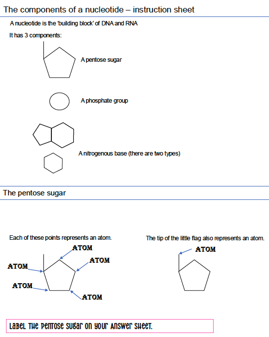
  <div class="activity-meta">
    <span class="activity-tag">Molecular Genetics</span>
    <span class="activity-title">Nucleotide Structure</span>
  </div>
</a>

<a class="activity-card" href="pdfs/Nucleotide_student_answersheet_key.pdf" target="_blank">
  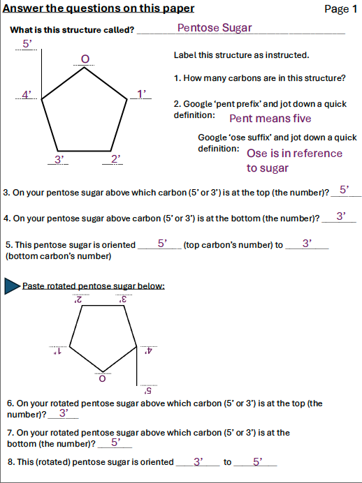
  <div class="activity-meta">
    <span class="activity-tag">Key</span>
    <span class="activity-title">Nucleotides Activity Key</span>
  </div>
</a>

</div>
```

## Ploidy

```{=html}
<div class="activity-grid">

<a class="activity-card" href="pdfs/Ploidy_student_instructions.pdf" target="_blank">
  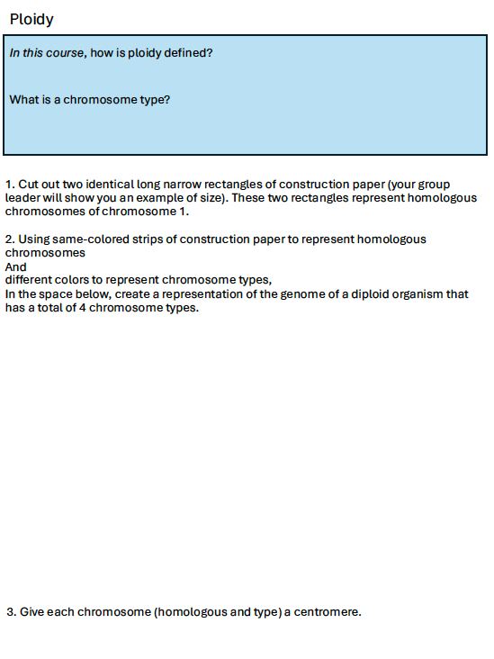
  <div class="activity-meta">
    <span class="activity-tag">Ploidy</span>
    <span class="activity-title">Ploidy</span>
  </div>
</a>

</div>
```

## Foundations of Inheritance & Cell Division

```{=html}
<div class="activity-grid">

<a class="activity-card" href="pdfs/Mitosis_meiosis_genotype_phenotype.pdf" target="_blank">
  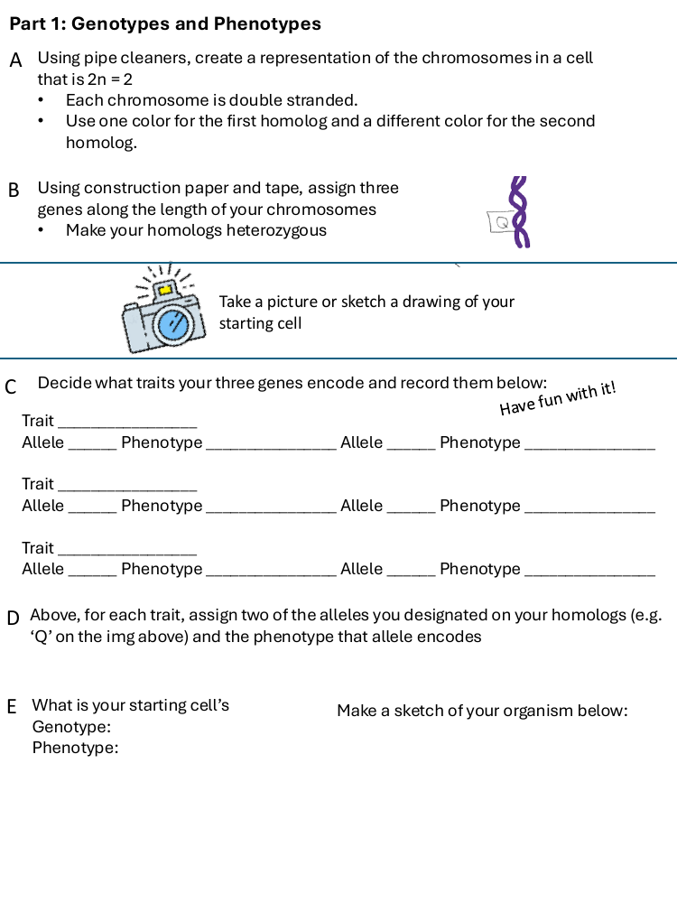
  <div class="activity-meta">
    <span class="activity-tag">Cell Division</span>
    <span class="activity-title">Mitosis, Meiosis, Genotype &amp; Phenotype</span>
  </div>
</a>

</div>
```

## DNA Replication

```{=html}
<div class="activity-grid">

<a class="activity-card" href="pdfs/DNA_Replication_StudentInstructions.pdf" target="_blank">
  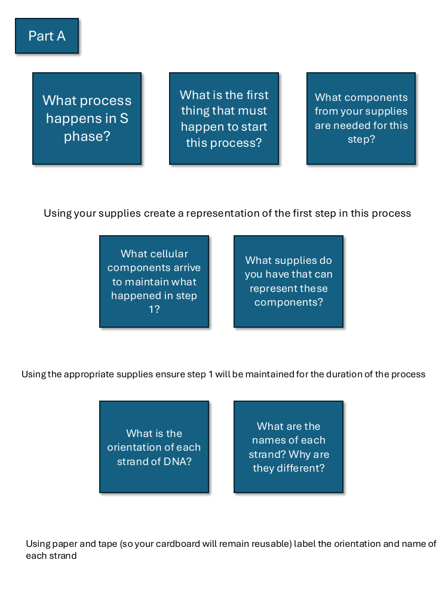
  <div class="activity-meta">
    <span class="activity-tag">Instructions</span>
    <span class="activity-title">DNA Replication — Student Instructions</span>
  </div>
</a>

<a class="activity-card" href="pdfs/DNA_Replication_Components.pdf" target="_blank">
  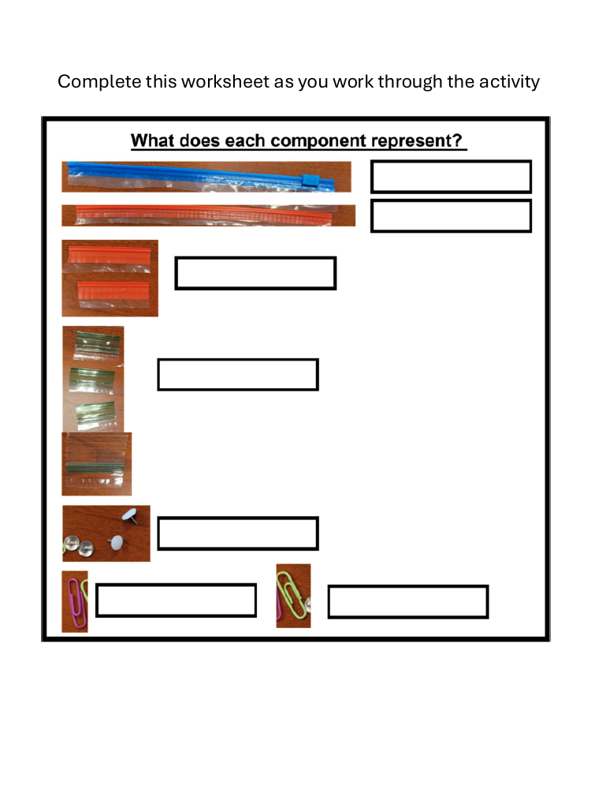
  <div class="activity-meta">
    <span class="activity-tag">Reference</span>
    <span class="activity-title">DNA Replication — Components</span>
  </div>
</a>

<a class="activity-card" href="pdfs/DNA_Replication_PartA.pdf" target="_blank">
  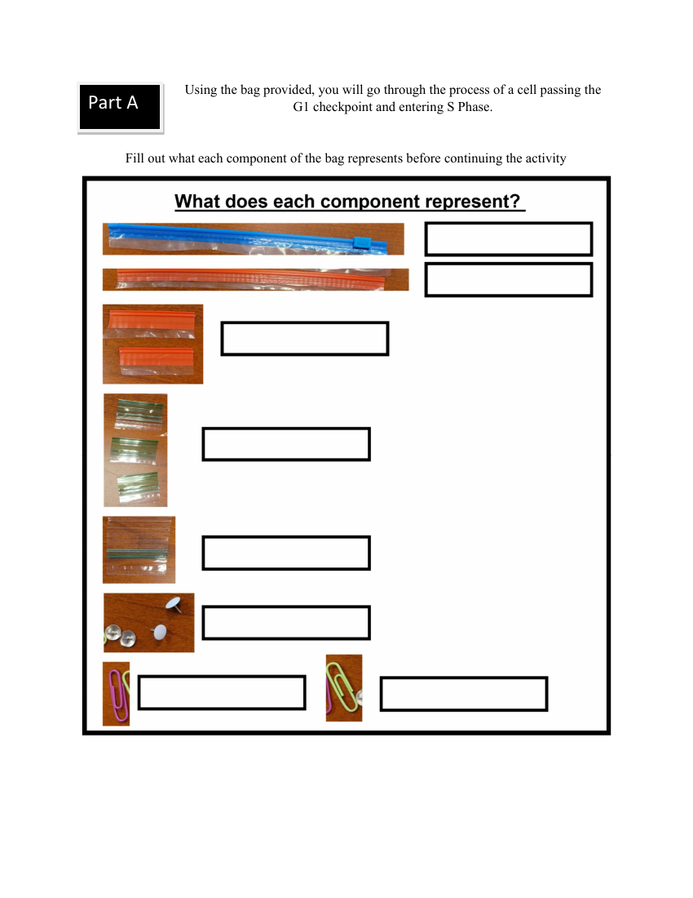
  <div class="activity-meta">
    <span class="activity-tag">Activity</span>
    <span class="activity-title">DNA Replication — Part A</span>
  </div>
</a>

<a class="activity-card" href="pdfs/DNA_Replication_PartA_Key.pdf" target="_blank">
  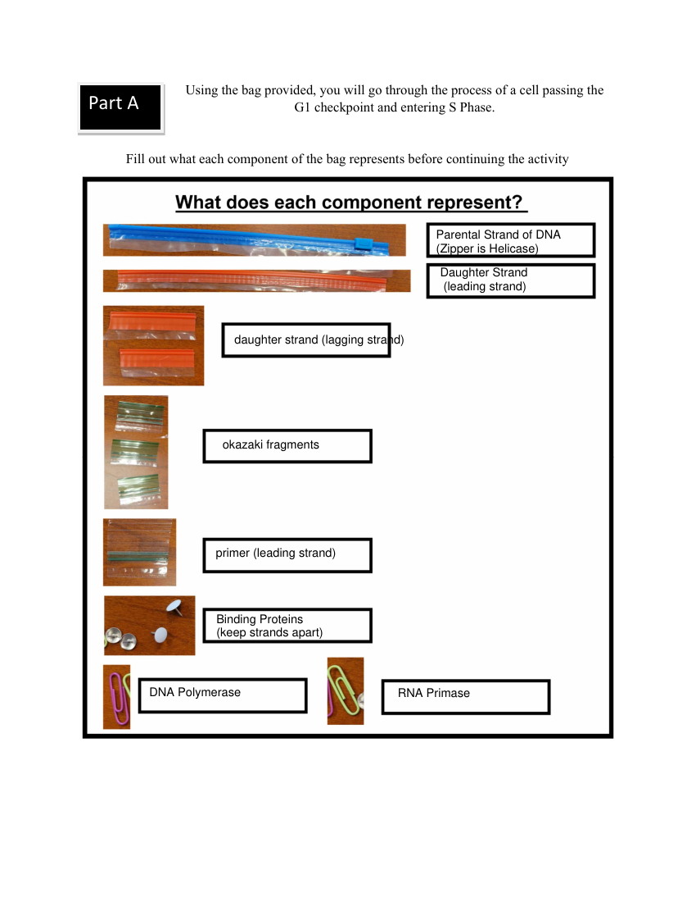
  <div class="activity-meta">
    <span class="activity-tag">Answer Key</span>
    <span class="activity-title">DNA Replication — Part A Key</span>
  </div>
</a>

<a class="activity-card" href="pdfs/DNA_Replication_Full_Key.pdf" target="_blank">
  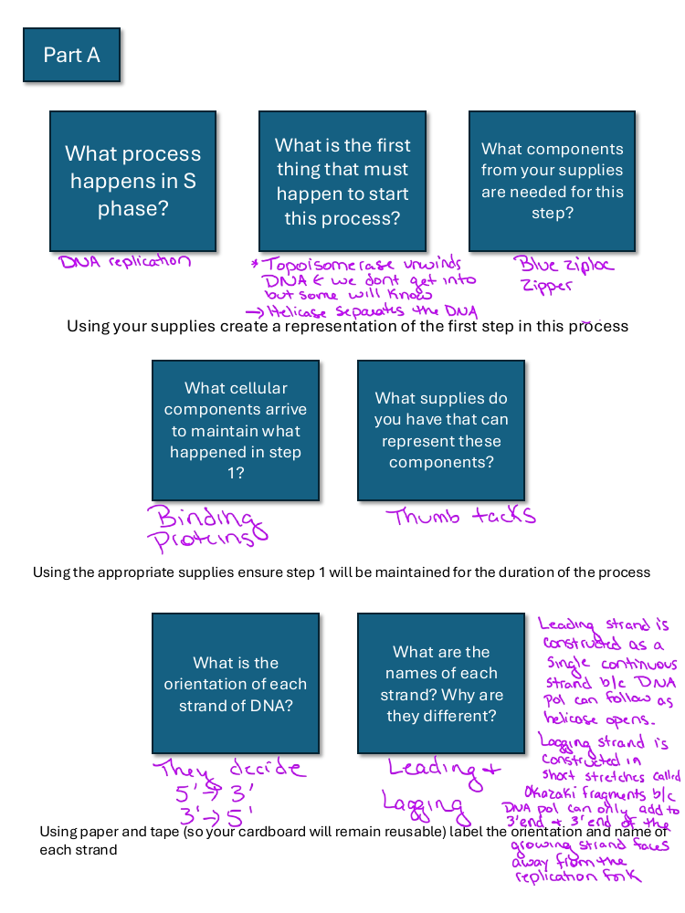
  <div class="activity-meta">
    <span class="activity-tag">Answer Key</span>
    <span class="activity-title">DNA Replication — Full Key</span>
  </div>
</a>

</div>
```

## Mutation

```{=html}
<div class="activity-grid">

<a class="activity-card" href="pdfs/Mutation_PartA.pdf" target="_blank">
  
  <div class="activity-meta">
    <span class="activity-tag">Activity</span>
    <span class="activity-title">Mutation — Part A</span>
  </div>
</a>

<a class="activity-card" href="pdfs/Mutation_PartB.pdf" target="_blank">
  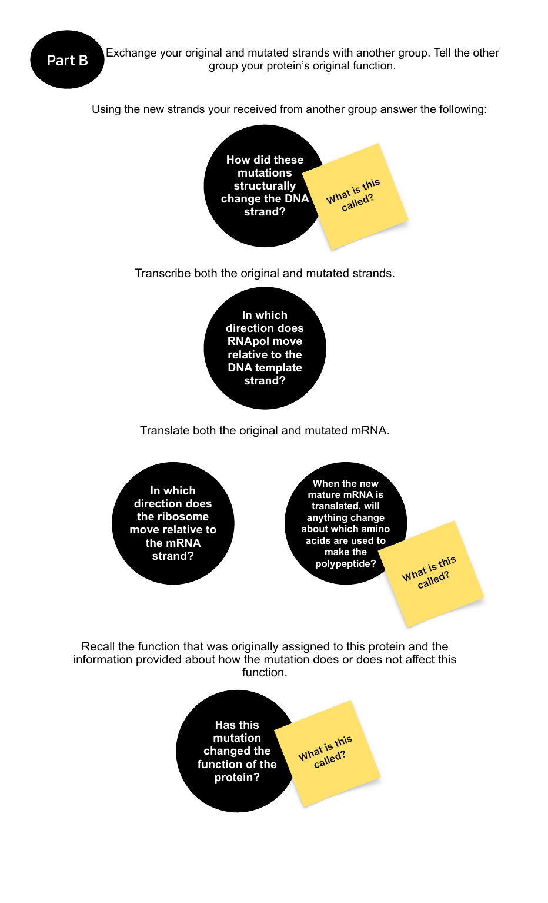
  <div class="activity-meta">
    <span class="activity-tag">Activity</span>
    <span class="activity-title">Mutation — Part B</span>
  </div>
</a>

<a class="activity-card" href="pdfs/Mutation_PartC.pdf" target="_blank">
  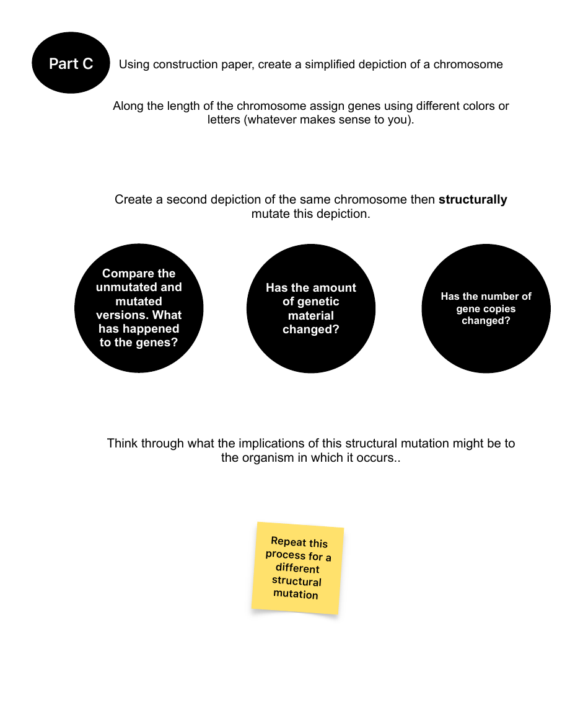
  <div class="activity-meta">
    <span class="activity-tag">Activity</span>
    <span class="activity-title">Mutation — Part C</span>
  </div>
</a>

<a class="activity-card" href="pdfs/Mutation_Complete.pdf" target="_blank">
  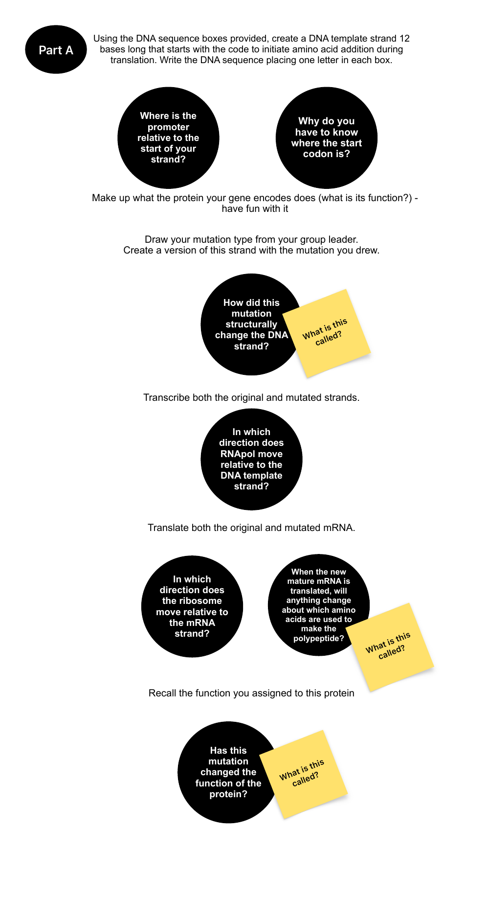
  <div class="activity-meta">
    <span class="activity-tag">Combined</span>
    <span class="activity-title">Mutation — Complete Activity</span>
  </div>
</a>

</div>
```

## Sex Linkage

```{=html}
<div class="activity-grid">

<a class="activity-card" href="pdfs/Sex_Linkage.pdf" target="_blank">
  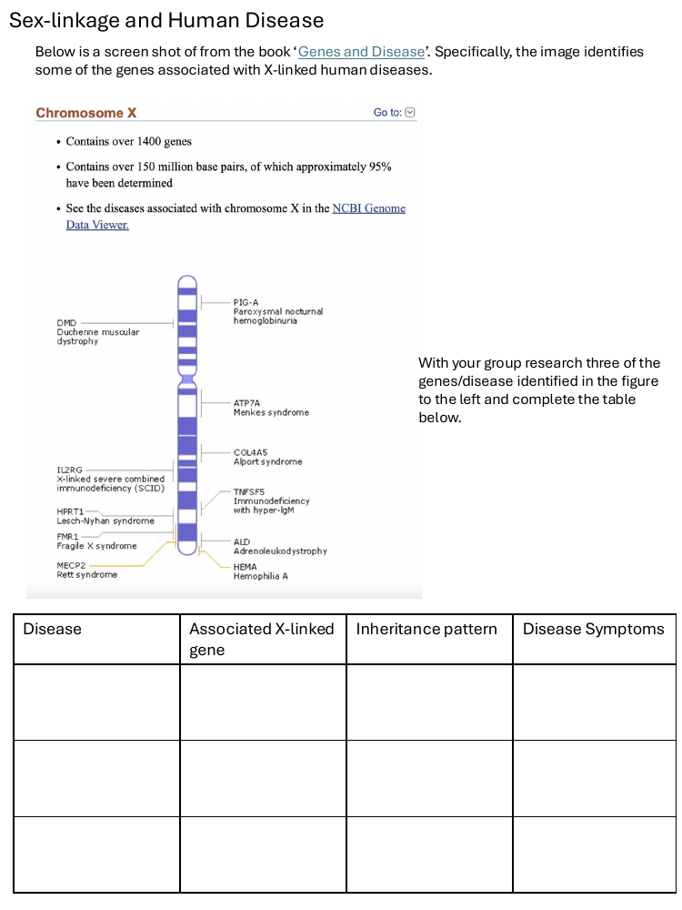
  <div class="activity-meta">
    <span class="activity-tag">Activity</span>
    <span class="activity-title">Sex Linkage</span>
  </div>
</a>

<a class="activity-card" href="pdfs/Expressivity_Penetrance_Examples.pdf" target="_blank">
  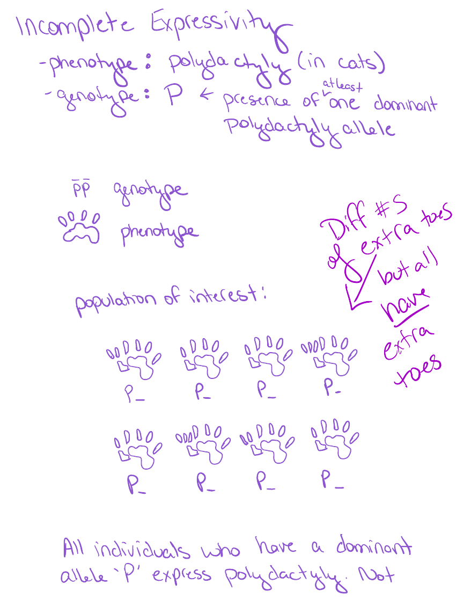
  <div class="activity-meta">
    <span class="activity-tag">Examples</span>
    <span class="activity-title">Expressivity &amp; Penetrance</span>
  </div>
</a>

</div>
```

## Population Genetics

```{=html}
<div class="activity-grid">

<a class="activity-card" href="pdfs/HWE_NatSel_Drift.pdf" target="_blank">
  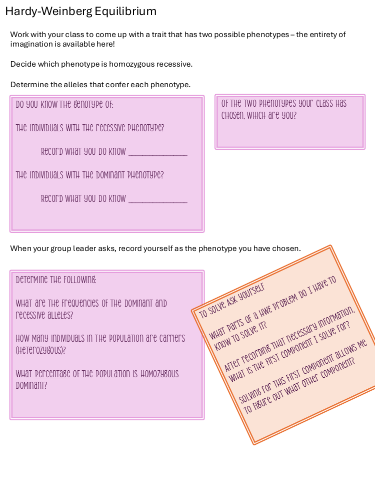
  <div class="activity-meta">
    <span class="activity-tag">Activity</span>
    <span class="activity-title">Hardy-Weinberg, Natural Selection &amp; Drift</span>
  </div>
</a>

</div>
```

---

::: {.callout-note}
## More activities coming soon
Additional activities — including Nucleotides, Translation, Ploidy, and Epigenetics — will be added as they're finalized.
:::
