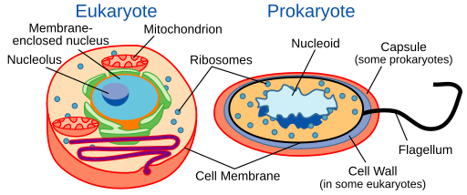
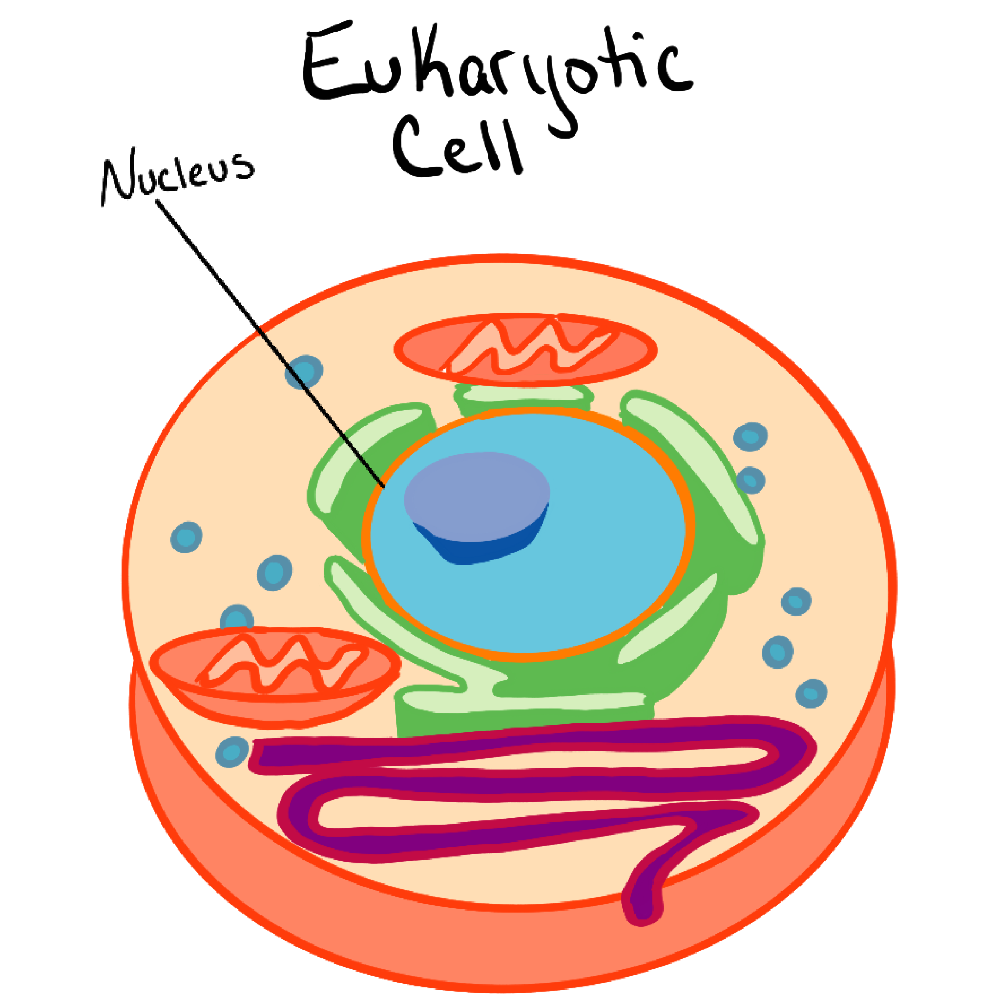
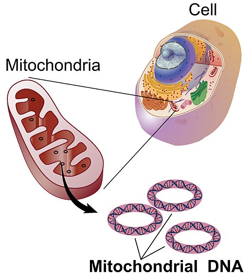
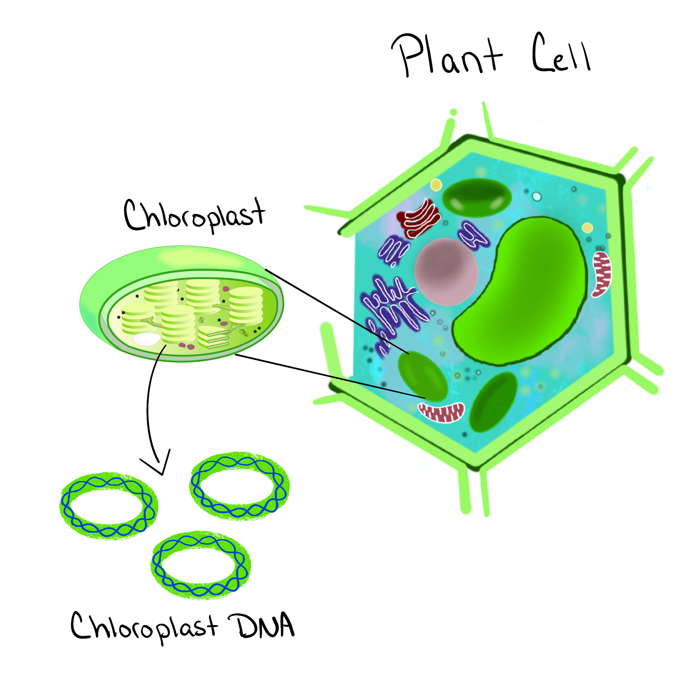

## What is a genome?

:::callout-note
### Official definition
The National Human Genome Research Institute defines a **[genome](https://www.genome.gov/genetics-glossary/Genome){target="_blank"}** as the complete set of DNA in an organism.
:::

A **genome** is “all the DNA” — but *all the DNA in what system?*  
Eukaryotic cells can contain **more than one genome** (nuclear + mitochondrial, and chloroplast in plants).

:::callout-important
### Avoid a common confusion
- **“Genome”** = all DNA in the system being discussed  
- **“Nuclear genome”** = all DNA in the nucleus  
- **“Mitochondrial genome”** = all DNA in mitochondria 
- **“Chloroplast genome”** = all DNA in chloroplast  
:::

---

## Eukaryote: DNA is in compartments

**What to notice**

In the Eukaryotic cell on the left there are membrane-bound organelles including:

- A **nucleus** (holds most DNA)
- **Mitochondria** (have their own DNA)

The prokaryotic cell on the right lacks organelles (more on that later).

{fig-alt="Labeled eukaryotic and prokaryotic cells" width=95%}
*Figure. A eukaryotic cell has a nucleus and organelles a prokaryotic cell does not (more on that below).* Image Source: Science Primer (National Center for Biotechnology Information). Vectorized by Mortadelo2005., Public domain, via Wikimedia Commons

---

## Nuclear genome: DNA inside the nucleus

**What to notice**

- DNA is stored inside a **membrane-bound nucleus**
- This DNA is packaged and organized (later: chromosomes)

{fig-alt="Labeled nucleus diagram" width=95%}
*Figure. The nucleus houses most DNA in eukaryotic cells.*

---

## Mitochondrial genome: DNA inside mitochondria

**What to notice**

- Mitochondria contain many **small circular DNA molecules**
- It’s separate from the nuclear genome

{fig-alt="Mitochondrion diagram" width=95%}
*Figure. Magnification of the mitochondria from an animal cell and a depiction of mitocondrial circular DNA.* Image Source: National Human Genome Research Institute, Public domain, via Wikimedia Commons

---

## Chloroplast genome: DNA inside chloroplasts (plants/algae)

**What to notice**

- Chloroplasts (the organelles that perform photosynthesis) also contain their own DNA
- Like mtDNA, it is typically **circular**

{fig-alt="Chloroplast diagram" width=95%}
*Figure.  A plant cell, a chloroplast, and circular chloroplast DNA.*

---

## Prokaryote: no nucleus, DNA is in the nucleoid

**What to notice**

A prokaryotic cell doesn't have membrane-bound organelles. It has:

- No nucleus
- DNA concentrated in a **nucleoid region**
- Often small extra DNA circles (**plasmids**)

{fig-alt="Labeled prokaryotic cell with nucleoid and plasmids" width=95%}
*Figure. Eukaryotic cell on the left, Prokaryotic cell with nucleoid DNA on the right.* Image Source: Science Primer (National Center for Biotechnology Information). Vectorized by Mortadelo2005., Public domain, via Wikimedia Commons

:::callout-note
### Vocabulary checkpoint
The **nucleoid** is not an organelle—it’s just the region where the chromosome is located.
:::
