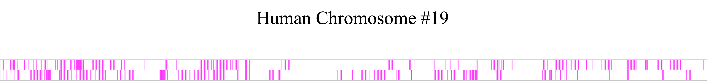
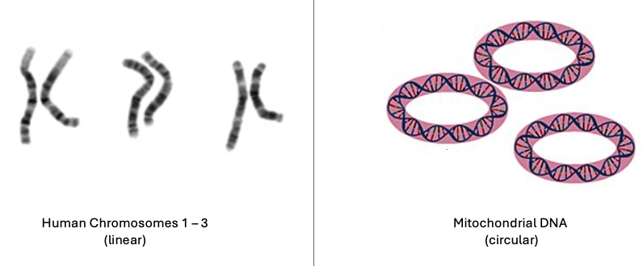
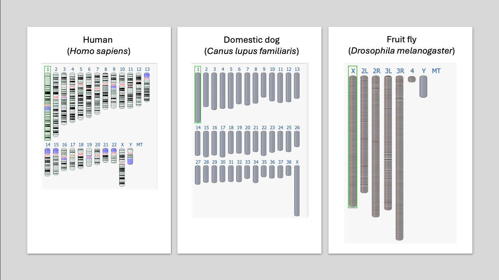

## Key Points

- what a **chromosome** is
- how chromosomes differ from each other
- what it means for chromosomes to be **homologous**

***

## What is a chromosome?

A **chromosome** is:

- one single DNA molecule
- packaged with proteins
- containing many genes and many sections without genes (intergenic regions)
- defined by the genes it carries

:::callout-important
### Common misconception
A chromosome is not a single gene — it is a **collection of many genes and intergenic regions arranged along one DNA molecule**.
:::

{width=100%}
*Figure 2. A representation of human chromosome 19 as if it were layed flat. This single molecule of DNA is 58,517,616 base pairs long and encodes ~1500 genes. The image depicts genes as pink lines and intergenic regions as white space.*

## Chromosomes can be different shapes
- Some chromosomes are linear (like a piece of spagetti)
- Some chromosomes are circular (like a fruit loop)
{width=100%}
*Figure 1. Left: Chromosomes 1 - 3 of a human karyotype illustrating linear chromosomes. Right: A depiction of mitochondrial DNA illustrating circular chromosomes.* 
Image source: National Human Genome Research Institute, Public domain, via Wikimedia Commons. Science Primer (National Center for Biotechnology Information). Vectorized by Mortadelo2005., Public domain, via Wikimedia Commons. Edited by author. 

***
## Chromosome Types
Chromosome types are defined by which genes they carry. For example chromosome 19 above is a distinct chromosome type. The 1500 genes it carries ar unique to it. The other 22 chromosome types that make up the human genome all carry genes different from those encoded by chromosome 19 and also different from each other. Each chromosome type carries a **unique set of genes**.

**What to notice**

None of the three chromosome types share genes. 

{width=100%}
*Figure 2. The image above illustrates the concept of chromosome types. The three chromosome types each encode a set of genes, none of the genes are shared across chromosome types. For example chromosome 1 encodes gene A, neither chromosome 2 nor chromosome 3 encode gene A.*

:::callout-note
### Important distinction
Two chromosomes are only considered the “same type” if they carry the **same genes in the same order**.
:::

***

## Different species have different numbers of chromosome types

There is **no universal chromosome number**.

Examples:

- Humans: 23 chromosome types
- Dogs: 39 chromosome types
- Fruit flies: 4 chromosome types

{width=100%}
*Figure 4. [Idoegrams](https://www.nature.com/scitable/topicpage/chromosome-mapping-idiograms-302/){target="_blank"} of Human, Domestic dog, and Fruit fly chromosomes types.* Source: National Center for Biotechnology Information [Genome Data Viewer](https://www.ncbi.nlm.nih.gov/gdv){target="_blank"}.

:::callout-note
### Do not assume
More chromosomes does **not** mean “more complex.”
:::

***

## What are homologous chromosomes (homologs)?

In many organisms, chromosomes come in **sets**.

**Homologous chromosomes** (or **homologs**) are the same chromosome type meaning each chromosome in the set has the same gene content in the same order.

{width=95%}
*Figure 4. A homologous pair of chromosomes.*

***

## Homologs have the same genes, but not necessarily the same alleles

This point is *critical*.

**Homologous chromosomes:**

- have the **same genes**
- have those genes in the **same locations**
- may carry **different alleles**

:::callout-note
### What is an allele?
**Allele** - different version of a gene. For example, if a gene codes for flower color, all alleles of that gene code for flower color but one allele might code for purple flower color while another codes for white flower color. 
:::

In the image below the letter case (e.g. A vs a) represents the allele. These homologs carry different alleles for Gene A, B, and C. 
 
{width=100%}
*Figure 5. Homologous chromosomes carry the same genes but may have different alleles.*

:::callout-important
### One sentence to memorize
**Homologs = same genes, possibly different alleles.**
:::

***

## Homologs vs different chromosome types (do not mix these up)

| Comparison | Homologous chromosomes | Chromosome types |
|---------|----------------------|----------------------|
| Gene content | Same genes | Different genes |
| Gene order | Same order | Different |
| Alleles | May differ | Not comparable |

***

## How many chromosomes are there in a set?

This depends on the organism and the cell type.

Humans are diploid organisms. This means most of our cells have two (2) homologs in a set.

:::callout-note
### Diploid

- Di = two
- ploid = number of chromosomes
:::

:::callout-note
### Preview
The number of chromosomes in a complete set is called **ploidy** — that’s next.
:::

***

## Big picture summary

- A **chromosome** is a single DNA molecule containing many genes and intergenic regions
- Different **chromosome types** carry different genes
- **Homologous chromosomes** are the same chromosome type carrying the same genes but may have different alleles
- Species can differ in:
  - number of chromosome types
  - number of homologs in a complete set (ploidy)

