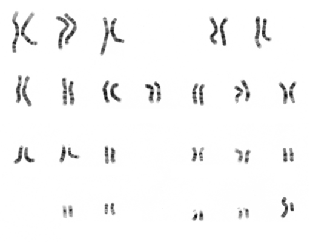
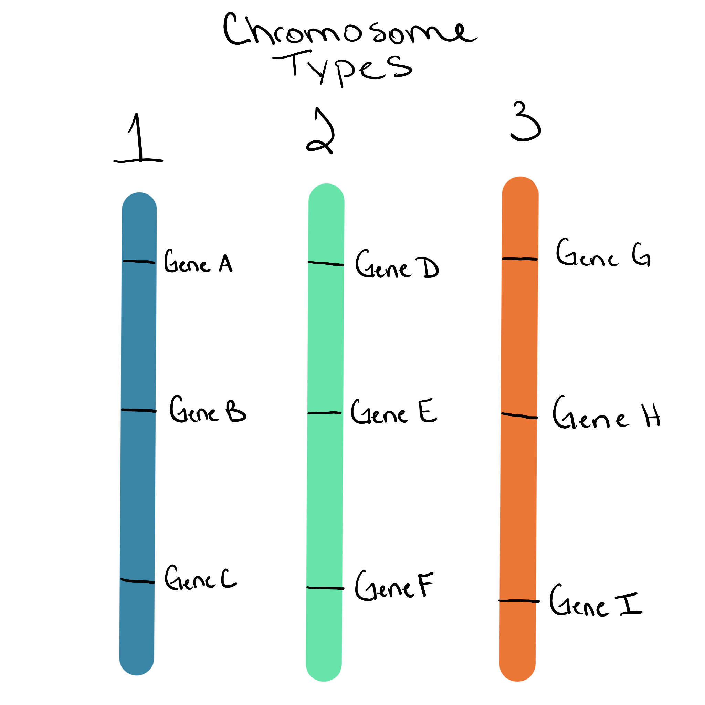
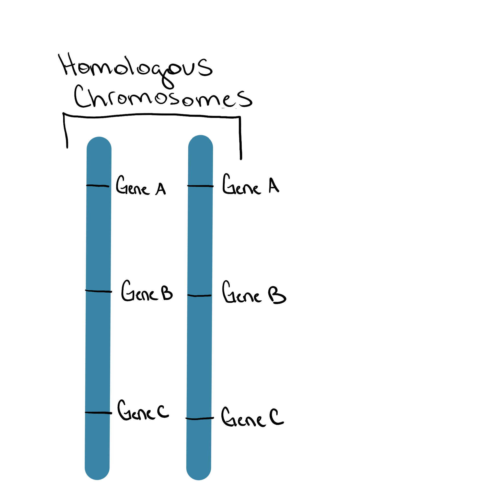
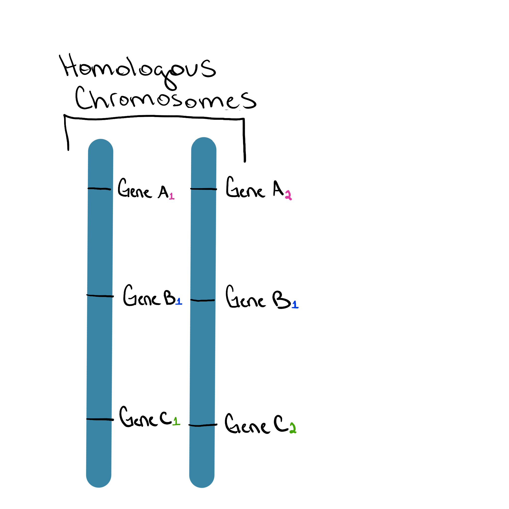

## Why chromosomes matter

- what a **chromosome** is
- how chromosomes differ from each other
- what it means for chromosomes to be **homologous**

This section builds the mental model you’ll use all semester.

---

## What is a chromosome?

A **chromosome** is:
- one single DNA molecule
- packaged with proteins
- containing many genes and many sections without genes (intergenic regions)
- defined by the genes it carries

:::callout-important
### Key idea
A chromosome is not a single gene — it is a **collection of many genes and intergenic regions arranged along one DNA molecule**.
:::

## Chromosomes can be different shapes
- Some chromosomes are linear (like a piece of spagetti)
- Some chromosomes are circular (like a fruit loop)
{width=50%}
{width=50%}
*Figure 1. A human male karyotype showing linear chromosomes.* 
Image source: National Human Genome Research Institute, Public domain, via Wikimedia Commons. *Figure 2. A cell, mitochondria, and representation of mitochondrial circular DNA* 
Image Source: Science Primer (National Center for Biotechnology Information). Vectorized by Mortadelo2005., Public domain, via Wikimedia Commons

---

## Different chromosomes carry different genes

Each chromosome type carries a **different set of genes**.

**What to notice**
- Chromosome 1 has genes that chromosome 2 does not
- Chromosome 2 has genes that chromosome 3 does not

{width=100%}
*Figure 2. Different chromosomes contain different genes.*

:::callout-note
### Important distinction
Two chromosomes are only considered the “same type” if they carry the **same genes in the same order**.
:::

---

## Different species have different numbers of chromosome types

There is **no universal chromosome number**.

Examples:
- Humans: 23 chromosome types
- Dogs: 39 chromosome types
- Fruit flies: 4 chromosome types
- Some plants: hundreds

:::callout-note
### Do not assume
More chromosomes does **not** mean “more complex.”
:::

---

## What are homologous chromosomes (homologs)?

In many organisms, chromosomes come in **sets**.

**Homologous chromosomes** (or **homologs**) are the same chromosome type meaning each chromosome in the set has the same gene content in the same order.

{width=95%}
*Figure 4. A homologous pair of chromosomes.*

---

## Homologs have the same genes, but not necessarily the same alleles

This point is *critical*.

**Homologous chromosomes:**
- have the **same genes**
- have those genes in the **same locations**
- may carry **different alleles**

:::callout-note
### What is an allele?
Allele - different version of a gene. For example, if a gene codes for flower color, all alleles of that gene code for flower color but one allele might code for purple flower color while another codes for white flower color. 
:::

In the image below the number subscripts next to the gene name (e.g. 'A') represent the allele. These homologs carry different alleles for Gene A and C. 
They carry the same alleles for Gene B. 
{width=100%}
*Figure 5. Homologous chromosomes carry the same genes but may have different alleles.*

:::callout-important
### One sentence to memorize
**Homologs = same genes, possibly different alleles.**
:::

---

## Homologs vs different chromosomes (do not mix these up)

| Comparison | Homologous chromosomes | Different chromosomes |
|---------|----------------------|----------------------|
| Gene content | Same genes | Different genes |
| Gene order | Same order | Different |
| Alleles | May differ | Not comparable |

---

## How many copies of each chromosome are there?

This depends on the organism and the cell type.

Examples:
- **Diploid cells**: two homologs of each chromosome type
- **Haploid cells**: one copy of each chromosome type
- **Polyploid cells**: more than two copies

-> add img of chromosome copy number

:::callout-note
### Preview
The number of complete sets of homologs is called **ploidy** — that’s next.
:::

---

## Big picture summary

- A **chromosome** is a single DNA molecule containing many genes
- Different chromosomes carry **different genes**
- **Homologous chromosomes** are the same chromosome type carrying the same genes but may have different alleles
- Species can differ in:
  - number of chromosome types
  - number of copies of those chromosomes

