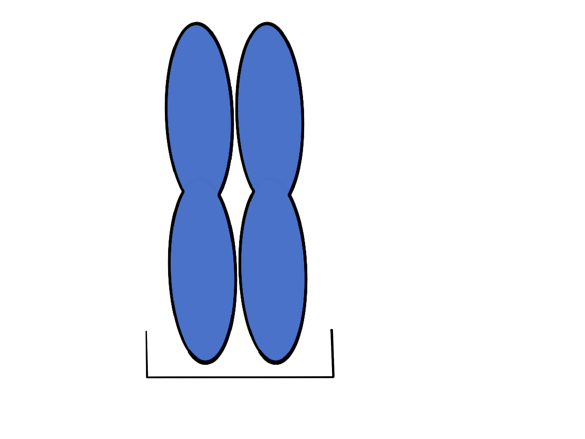
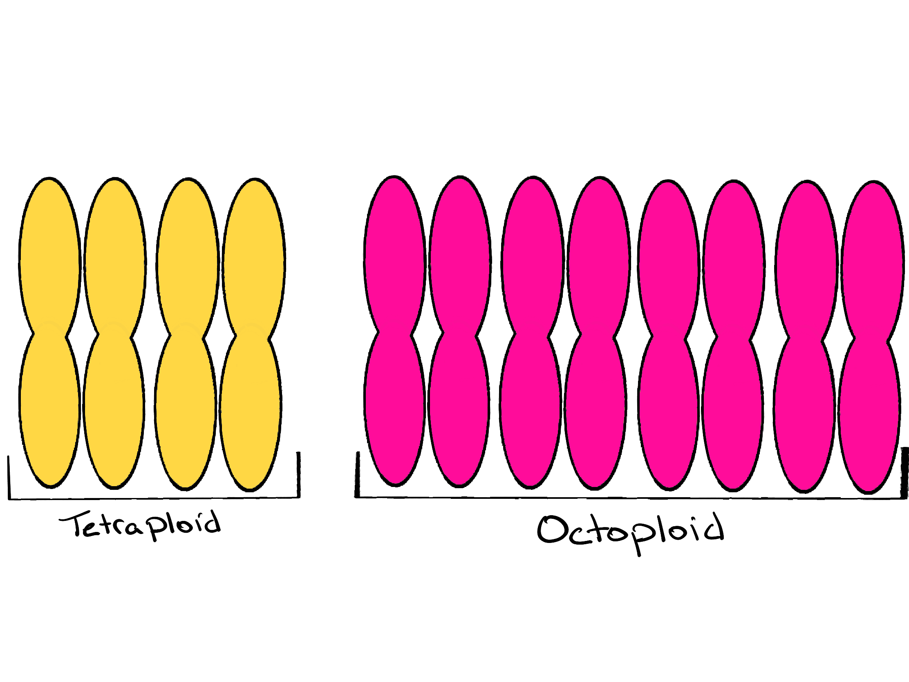
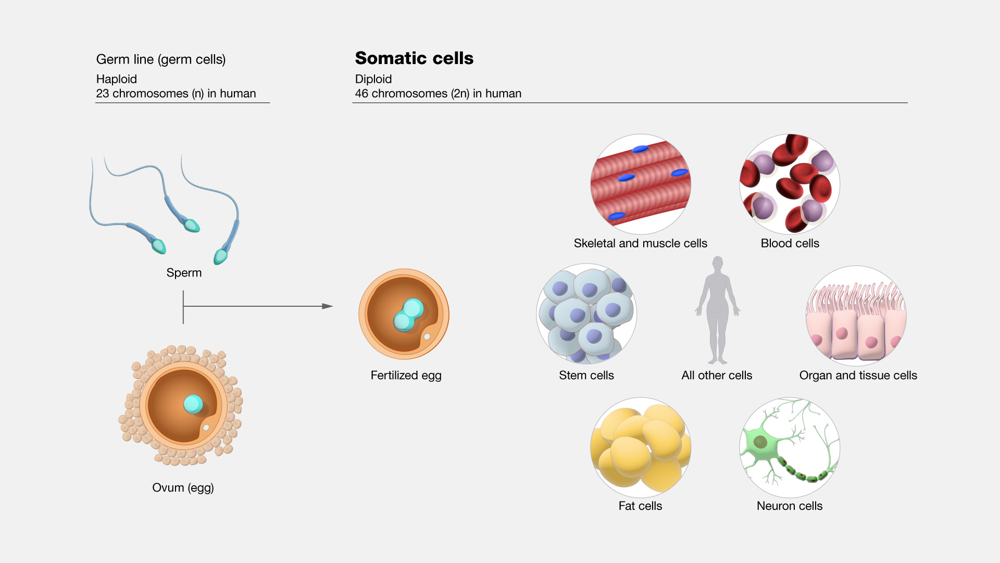
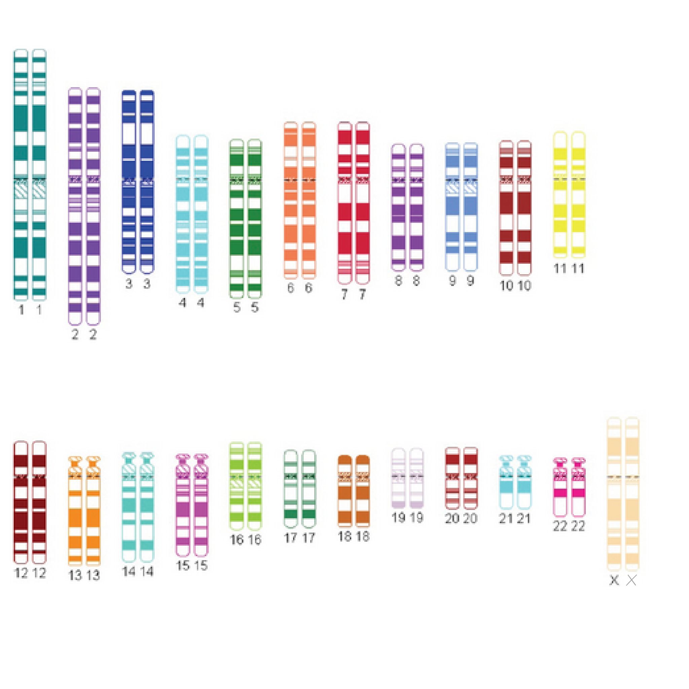
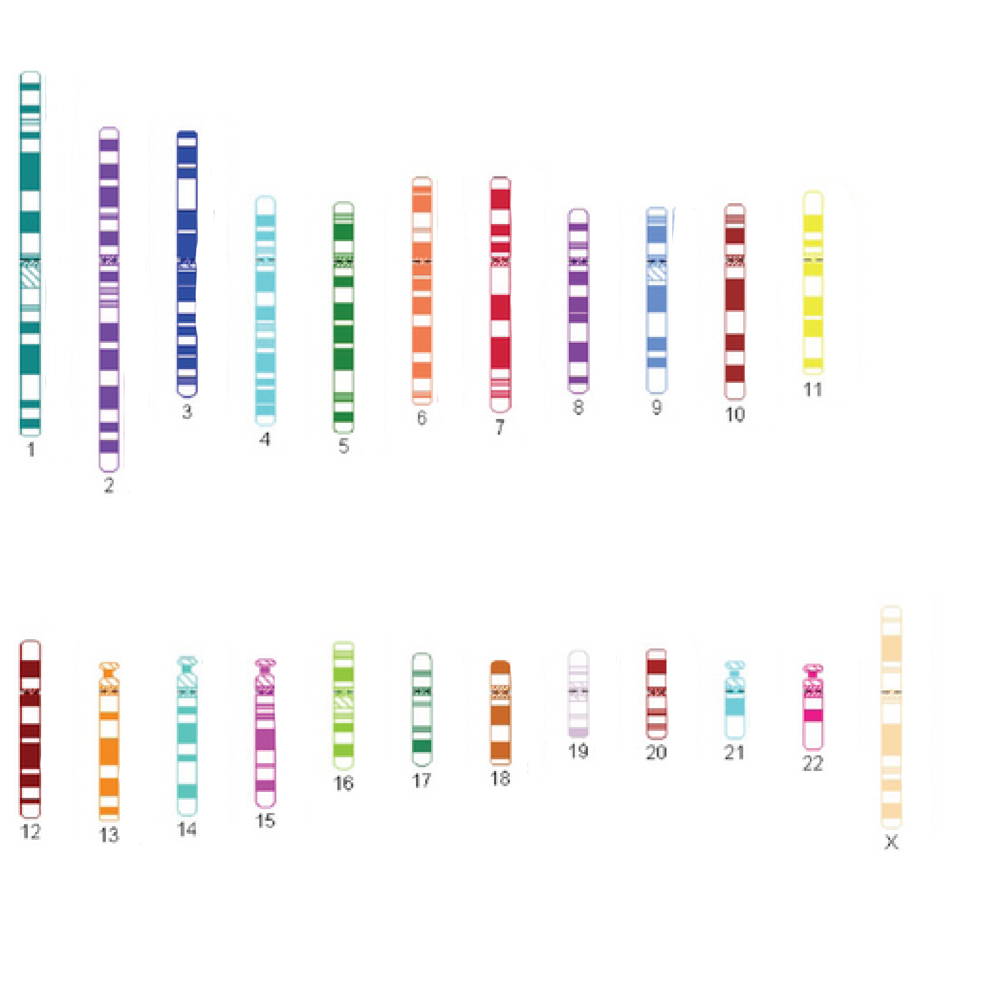
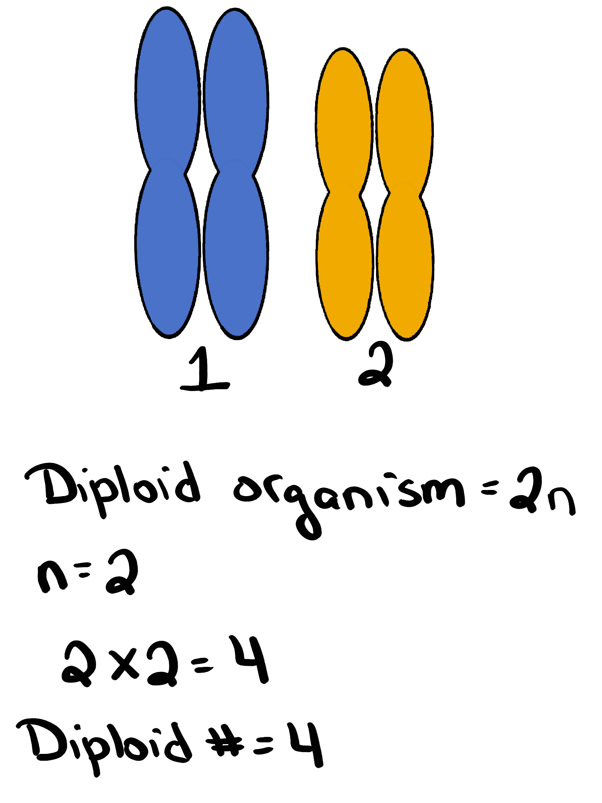
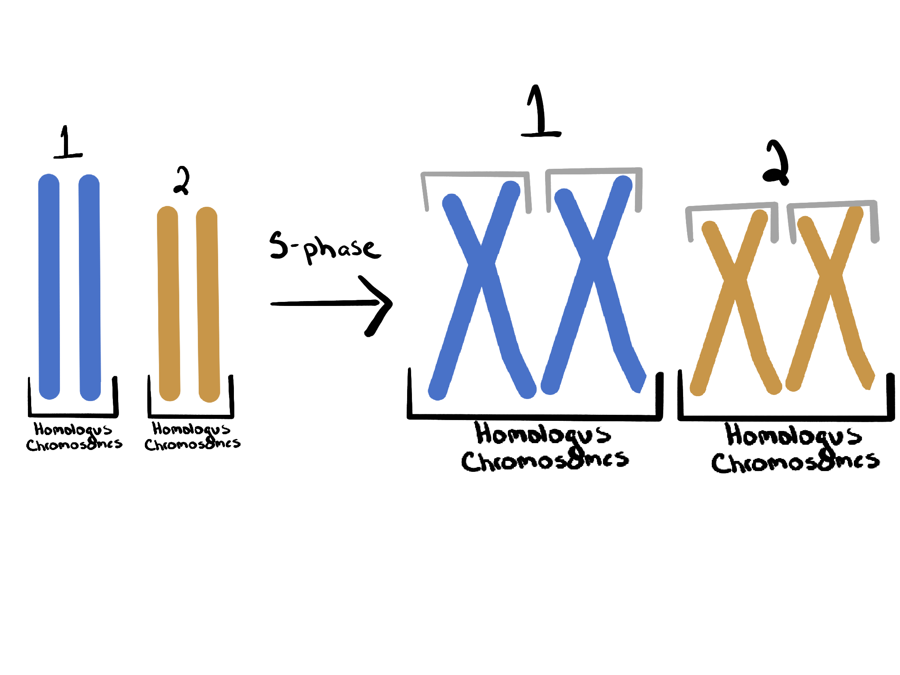

## What you’re learning here

By the end, you should be able to:

- Define **ploidy** *using our course definition*
- Determine ploidy level (haploid, diploid, triploid, tetraploid, etc.) from a diagram or description
- Tell the difference between a **diploid/haploid cell** and **diploid/haploid number**
- Calculate diploid number.
- Identify **homologous chromosomes** vs **sister chromatids**

***

## The core definition (use this all semester)

:::callout-important
### Ploidy (course definition)
**Ploidy = the number of chromosomes in a complete set of homologs.**
:::

## Different species and different cells can have different ploidy
### Species ploidy differences
When we refer to the ploidy of a species we are referring to the number of chromosomes that exist in a complete set in each somatic cell of an individual of that species.

- Humans and most mammals are diploid: two (2) homologs in each complete set.

:::callout-note
### Diploid

- Di = two
- ploid = number of chromosomes
:::

{width=100%}
Figure 1: *One set of diploid homologous chromosomes.*

Organisms that have more than two chromosomes in a complete set of homologous chromosomes are called **polyploid**.

:::callout-note
### Polyploid

- Poly = many
- ploid = number of chromosomes
:::

Polyploidy is common in plants, some species of strawberry have eight (8) chromosomes in each set of homologs (yes eight!). Polyploidy is less common in animals, but certainly not absent. [Various species of amphibians](https://pmc.ncbi.nlm.nih.gov/articles/PMC10044425/#sec1-animals-13-01033){target="_blank"} have ploidys ranging from three (3) to twelve (12), and polyploid species have been identified in all major groups of tetrapods. 

:::callout-note
### Polyploidy names
The ploidy of an organism is determined by the number of homologs in each complete set.

**Example:**

Tetraploid (four homologs in each complete set)

- Tetra = four
- ploid = number of chromosomes

**Example:**

Octoploid (eight homologs in each complete set)

- Tetra = eight
- ploid = number of chromosomes
:::

{width=100%}
Figure 2: *Two examples of polyploidy. One complete set of homologous chromosomes in a tetraploid organism and an octoploid organism.* 

:::callout-note
### Polypolidy in agriculture
Many plants are polyploid, and polyploidy is connected to traits like larger fruit size.
:::

### Cellular ploidy differences
Sexually reproducing species have two broad categories of cells: somatic and germ cells (gametes). Somatic cells make up the body's tissues and organs. Germ cells are specifically for sexual reproduction. Somatic cells contain whatever the number of homologs make a complete set. For example, in humans somatic cells are diploid (2). Germ cells are created entirely for reproduction so their chromosomoal complement gets halved (they have half as many). In humans, germ cells are haploid (1). Think haploid = half. We will return to this in detail when we cover meiosis. 

{width=100%}
Figure 3: *Human germ cells and somatic cells.* 
Source: National Human Genome Reserach Institute [talking glossary of genomic and genetic terms](https://www.genome.gov/genetics-glossary/Somatic-Cells){target="_blank"}.

## “Diploid cell” vs “diploid number” (they are not the same)

**Diploid cell** = has **two** versions of each chromosome (two homologs). 
**Diploid number** = the **total** number of chromosomes in that diploid cell.

:::callout-note
### What does 2n mean
- **2n** describes a *diploid cell* (two homologs per chromosome type)
- **2n** also helps you calculate the *diploid number* once you know **n**
- **n** is a variable, it can be replaced with the number of chromosome types to solve for the diploid number
:::

{width=100%}
*Figure 4. A human diploid ideogram: two homologs for each chromosome type.*
Source: [UPO649 1112 mreycor1, CC BY-SA 3.0](https://creativecommons.org/licenses/by-sa/3.0), via Wikimedia Commons. Edited by author.

***

## What does **n** mean?

**n** = the number of **distinct chromosome types**. Remember that each chromosome type has its own unique set of genes. Humans have 23 chromosome types. Each of our 23 chromosomes has its own unique set of genes. 

{width=100%}
*Figure 5. Humans have 23 chromosome types. In humans n = 23.*
Source: [UPO649 1112 mreycor1, CC BY-SA 3.0](https://creativecommons.org/licenses/by-sa/3.0), via Wikimedia Commons. Edited by author.

### Example
Pretend a diploid organism has two chromosome types (chromosome 1 and 2). With this information we know:

- **n = 2**
- diploid cell is **2n**
- diploid number is **2 × 2 = 4**

{width=100%}
*Figure 6. If n=2, then 2n=4 total chromosomes in a diploid cell.*

***

## Haploid number

:::callout-important
### The cleanest shortcut
The **haploid number** is just **n**.
:::

***

## Why chromosomes sometimes look like “X” shapes

Before mitosis or meiosis, the cell replicates DNA in **S-phase**.

After replication:

- each chromosome has **two identical copies stuck together**
- those identical copies are **sister chromatids**
- they are joined at the **centromere**

{width=100%}
*Figure 7. A diploid organism with two chromosome types (1 & 2). On the left: Homologous chromosomes. On the right homologous chromosomes and sister chromatids. Sister chromatids are created during S-phase (synthesis phase of the cell cycle during which DNA replication occurs). Sister chromatids do not exist before S-phase.*

:::callout-note
### Quick check
- **Sister chromatids** = identical copies (same alleles), produced by DNA replicaiton
- **Homologous chromosomes** = same genes, alleles may differ
:::

## Summary (know this structure, not numbers)

- **n** = number of chromosome types in one complete set  
- **Ploidy** = number in a complete set of homologs  
- **2n** is diploid (two in a set), **n** is haploid (half of a diploid set) 
- After S-phase, chromosomes are duplicated, but **ploidy does not change** (you still have the same number of sets)

:::callout-important
### One sentence to keep you honest
**Replication makes sister chromatids; it does not change ploidy.**
:::
