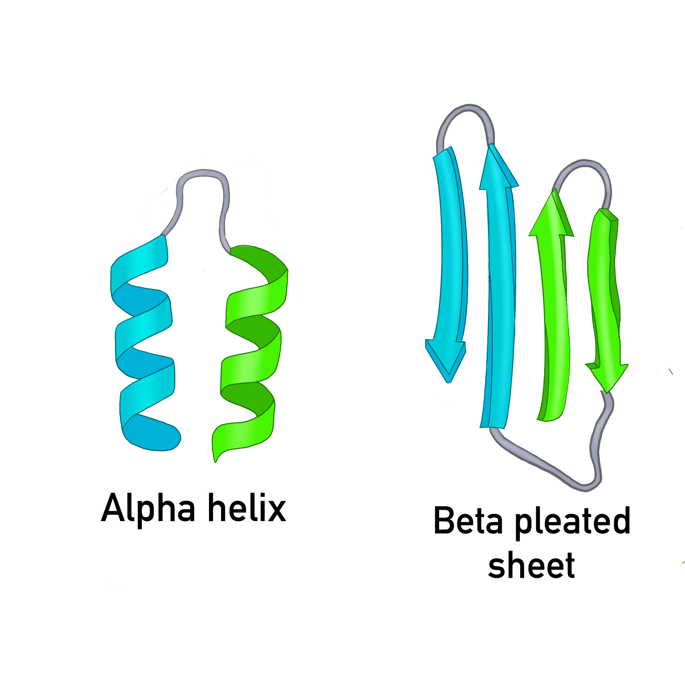
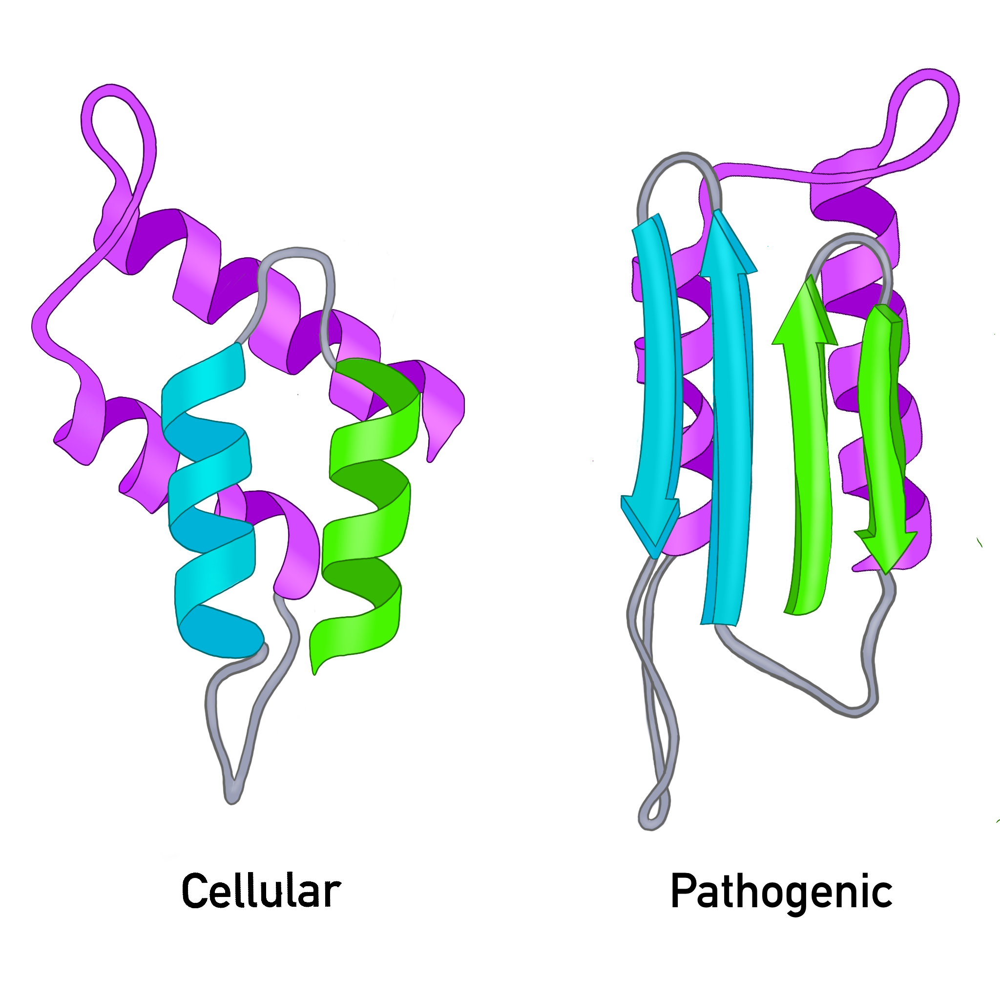

## Note: This page is a rough draft, still a work in progress

## What you should understand

By the end of this section, you should be able to:

- Explain why prions are unusual infectious agents
- Distinguish between the normal and pathogenic forms of prion protein
- Describe how prions spread within the body
- Identify major human and animal prion diseases
- Explain why prion diseases are so damaging to the brain

***

## What is a prion?

A **prion** is an **infectious misfolded protein**.

:::callout-important
### Key idea
Prions are unusual because they can spread disease **without using DNA or RNA**.
:::

Most infectious agents, such as bacteria and viruses, rely on nucleic acids (DNA or RNA). Prions do not. Instead, they spread by causing a **normal protein** to change shape into a harmful form.

***

## The cellular and pathogenic forms
The protein involved is called a **Prion protein**, shorthand: **PrP**
The prion protein that carries out normal cellular funciton is called the **cellular form**, shorthand: **PrPC**.  
The disease-causing form is called the **pathogenic form**, shorthand: **PrPSc**.

### PrPC (cellular form)
- cellular protein found in the body
- soluble
- sensitive to proteases
- rich in **alpha helices** (see Figure 1.)

### PrPSc (pathogenic form)
- misfolded form
- tends to aggregate
- more resistant to proteases
- enriched in **beta sheets** (See Figure 1.)

{width=100%}
*Figure 1. The cellular prion protein is dominated by the alpha helix secondary protien shap. The pathogenic prion protein is dominated by the beta pleated sheet secondary protein shape.*

{width=100%}
*Figure 2. The cellular prion protein and the pathogenic prion protein differ in shape which leads to different behavior.*

:::callout-note
### Important distinction
The problem is not that the prion protein is foreign.  
The problem is that a typically normal cellular protein **folds into the wrong shape**.
:::

***

## How do prions spread?

Prions spread by **template-directed misfolding**.

A misfolded prion protein can interact with a cellular prion protein and cause it to misfold as well. This creates a chain reaction.

*Figure 3. A pathogenic prion protein can induce cellular prion proteins to adopt the same harmful shape.*

As misfolded proteins accumulate, they form aggregates and amyloid-like structures that damage nervous tissue.

*Figure 4. Misfolded prion proteins accumulate into aggregates that damage cells.*

***

## How can prion disease arise?

Prion diseases can arise in three main ways.

### 1. Sporadic
The disease appears without a clear external cause.

Example:
- sporadic Creutzfeldt-Jakob disease (sCJD)

### 2. Genetic
Mutations in the **PRNP** gene increase the likelihood of prion misfolding.

Example:
- fatal familial insomnia (FFI)

### 3. Acquired
Exposure to infectious prion material causes disease.

Examples:
- contaminated surgical instruments
- contaminated food
- infected tissue exposure

## Human and animal prion diseases

### Human prion diseases
- Creutzfeldt-Jakob disease (CJD)
- variant CJD (vCJD)
- fatal familial insomnia (FFI)
- Gerstmann-Sträussler-Scheinker syndrome (GSS)
- kuru

### Animal prion diseases
- bovine spongiform encephalopathy (BSE; “mad cow disease”)
- scrapie
- chronic wasting disease (CWD)

## Why do prions damage the brain?

Prion diseases are neurodegenerative diseases. As misfolded prion proteins accumulate, they disrupt normal brain function.

Major effects include:

- **synaptic dysfunction**  
  communication between neurons breaks down

- **neuroinflammation**  
  immune activity in the brain contributes to damage

- **cell death**  
  neurons are lost over time

*Figure 7. Prion accumulation leads to brain dysfunction and degeneration.*

:::callout-important
### Big picture
Prion diseases are progressive, fatal brain diseases caused by a misfolded protein that spreads its shape to other proteins.
:::

***

## Why are prions scientifically important?

Prions changed how scientists think about infection.

Before prions were discovered, infectious disease was thought to require a pathogen carrying nucleic acid. Prions showed that **protein shape alone** can carry biological information and spread disease.

This makes prions important not only for medicine, but also for our understanding of:
- protein folding
- neurodegeneration
- inheritance and mutation
- the relationship between structure and function

***

## Diagnosis and treatment

Prion diseases are difficult to diagnose early because they:
- often have long incubation periods
- share symptoms with other neurodegenerative diseases
- progress rapidly once symptoms appear

Common approaches include:
- MRI
- RT-QuIC
- post-mortem tissue analysis

There are currently **no effective cures**, but researchers are exploring:
- drugs that reduce aggregation
- methods to reduce normal prion protein production
- immunological approaches

***

## Summary

- A **prion** is an infectious misfolded protein
- Prions do **not** use DNA or RNA to spread
- The pathogenic form causes the normal form to misfold
- Prion diseases can be sporadic, genetic, or acquired
- Prions damage the nervous system and cause fatal neurodegeneration

***

## Check your understanding

1. Why are prions considered unusual infectious agents?
2. What is the difference between PrPC and PrPSc?
3. Why are homologous chromosomes and prions completely different concepts, even though both involve “versions” of a biological molecule?
4. Why does a change in protein shape matter so much in prion disease?